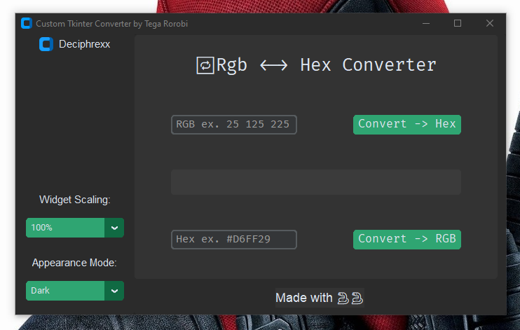

# RGB2Hex

## Description
RGB2Hex is a python application that converts RGB color codes to Hex values, 
and also does the reverse, converting Hex values to RGB formats. The project boasts
of a responsive and intuitive user interface, and the project also comes with a 
CLI for setting the mode (light or dark) and the accent colour.

## Tools & Modules Used
- Customtkinter
- CTkMessagebox
- Pillow
- sys, math, argparse

## Getting Started
### Running the application (assuming you have a python installation)

#### Step 1
Open your favourite terminal and navigate to a suitable directory.  
```bash
cd path/to/suitable/directory/
```

#### Step 2
Clone the repository into a virtual environment or download the zip
```
git clone https://github.com/TegaRorobi/RGB2Hex.git
```

#### Step 3
Install the requirements
```
python -m pip install -r requirements.txt
```

#### Step 4
Run the application (with a dark theme and a green accent color)
```
python rgb2hex.py --colors dark green
```

<br>

### Running the application via the executable (you don't need a python installation here)
#### Step 1
Clone the repository or download the zip
```
git clone https://github.com/TegaRorobi/RGB2Hex.git
```

#### Step 2
Unzip the _dist_ folder

#### Step 3
Simply Run the executable in the _dist_ folder

<br>

Note:
- You may have to install the [Fira Code](https://fonts.google.com/specimen/Fira+Code) font on your machine
- The executable works on only windows machines (support for other operating systems may be incorporated in future updates)
